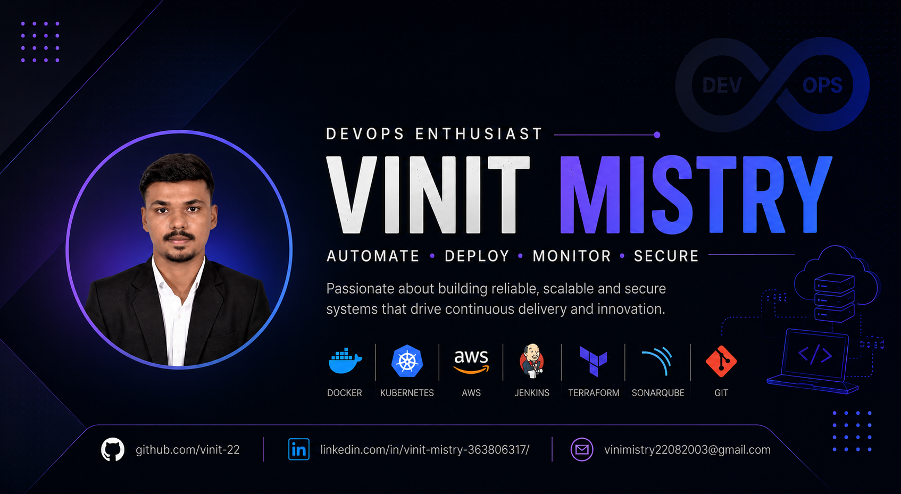

<!-- Use your own banner image URL below or keep the clean code-based layout -->

# V I N I T  M I S T R Y

### DevOps Engineer • Cloud Engineer 

`DevOps` • `Cloud Architecture` • `CI/CD Pipelines` • `Automation` • `Infrastructure as Code` 

### *Building Scalable Cloud Infrastructure, Automated Pipelines & Web Ecosystems.*

---

# 👋 About Me

I am an enthusiastic IT graduate with over 9 months of hands-on DevOps internship experience specializing in CI/CD pipelines, infrastructure automation, and cloud tooling. I bridge the gap between development and operations by combining full-stack web development skills with robust automation workflows.

I'm currently pursuing the Master Cloud Architecture course, deepening my expertise in designing fault-tolerant, multi-region cloud systems and building seamless, scalable software delivery infrastructure.

---

# ⚡ Tech Stack

## ☁️ Cloud & Core Infrastructure

## 🚀 DevOps & Automation

## 📊 Code Quality & Artifacts

## 💻 Languages & Frameworks

---

# 🧠 Current Focus

<table>
  <tr>
    <td>Advanced Cloud Architecture</td>
    <td>Multi-Region High Availability</td>
    <td>DevOps Automation Engineering</td>
  </tr>
  <tr>
    <td>Infrastructure as Code (IaC)</td>
    <td>CI/CD Pipeline Security Optimization</td>
    <td>GitOps Implementations</td>
  </tr>
</table>

---

# 📂 Featured Industry Experience & Projects

## 🔧 Work Experience & Implementations

| Arena / Project | Description | Tech Stack |
|:---|:---|:---|
| **DevOps Internships** (STL Digital & 1RIVET INDIA) | Contributed to automated CI/CD pipelines, handled code verification scans, tracked binary packages, and speeded up cycles. | Jenkins, Docker, SonarQube, Nexus, Ansible |
| **Nexo Omni-Channel Platform** | Connected UI components to database services, fine-tuned deployment tracks, and expanded capacity scaling. | React.js, PHP Laravel, SQL |
| **Space Reserve** | Developed a workspace coordination service utilizing automated booking limits and real-time floor grid status markers. | .NET, Angular, SQL DB |

---

# 🏅 Education & Credentials

*   🎓 **Bachelor of Engineering in IT** – Laxmi Institute of Technology (CGPA: 8.43)
*   🛡️ **Foundations of Cybersecurity** – Google
*   📈 **Manage Security Risk** – Google
*   🌀 **In Progress:** Master in Cloud Architecture 
